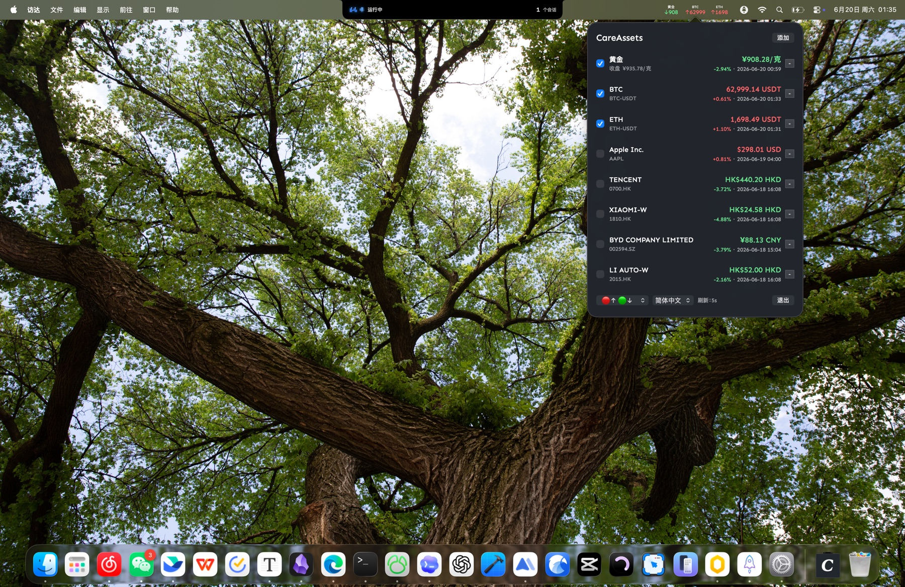

# CareAssets

CareAssets is a lightweight macOS menu bar app for keeping the assets you care about one glance away. It brings crypto, US stocks, Hong Kong stocks, A-shares, and gold into a compact status bar ticker with a clean popover for search, sorting, and display control.



## Highlights

- Lightweight menu bar ticker: selected assets stay visible in the macOS status bar.
- Multi-market tracking: crypto, US stocks, Hong Kong stocks, A-shares, and gold.
- Quick asset search: search stock codes, company names, or crypto names, then add with one click.
- Custom display: choose visible menu bar assets, drag to reorder, remove assets, and scroll long lists.
- Price color modes: white, red up/green down, or red down/green up.
- Title color modes: white, black, blue, yellow, and purple for better contrast on different menu bar backgrounds.
- Gold support: CNY/gram for Chinese market display and USD/oz for international display.
- Localized UI: Simplified Chinese, Traditional Chinese, English, Japanese, Arabic, German, French, Korean, Portuguese, and Spanish.
- Universal build: Apple Silicon and Intel Macs from one app bundle.

## Supported Assets

CareAssets currently supports:

- Crypto pairs from Coinbase Exchange, such as `BTC-USD`, `ETH-USD`, and other listed products.
- Stocks and ETFs from Yahoo Finance search/chart endpoints, including US, Hong Kong, A-share, and other supported symbols.
- Chinese gold price in CNY/gram through public gold quote endpoints.
- International gold price through Yahoo Finance gold futures data.

Data sources are public endpoints and may change or rate-limit without notice. CareAssets is a personal tracking utility, not financial advice.

## Requirements

- macOS 12.0 or later
- Xcode Command Line Tools

```bash
xcode-select --install
```

## Build

```bash
cd CareAssets
./build.sh
open build/CareAssets.app
```

The build script creates a universal `arm64 + x86_64` app bundle and ad-hoc signs it locally.

To install it manually:

```bash
cp -R build/CareAssets.app /Applications/
```

If macOS blocks the first launch because the app is not notarized, open it from System Settings > Privacy & Security, or right-click the app and choose Open.

## Configuration

CareAssets stores local configuration here:

```text
~/Library/Application Support/CareAssets/config.json
```

The config includes refresh interval, selected language, price color mode, title color mode, and your tracked assets.

## Privacy

CareAssets does not require an account and does not run a backend service. It stores configuration locally and fetches market data directly from public quote endpoints.

## Project Layout

```text
CareAssets/
  Sources/CareAssets/main.swift   # AppKit app source
  Resources/                      # App icons, logo, bundled font
  Info.plist
  build.sh
docs/
  careassets-screenshot.jpg
```

## License

MIT License. See [LICENSE](LICENSE).
